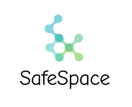

<!-- PROJECT SHIELDS -->
<!--
*** I'm using markdown "reference style" links for readability.
*** Reference links are enclosed in brackets [ ] instead of parentheses ( ).
*** See the bottom of this document for the declaration of the reference variables
*** for contributors-url, forks-url, etc. This is an optional, concise syntax you may use.
*** https://www.markdownguide.org/basic-syntax/#reference-style-links
-->
[![Contributors][contributors-shield]][contributors-url]
[![Forks][forks-shield]][forks-url]
[![Stargazers][stars-shield]][stars-url]
[![Issues][issues-shield]][issues-url]
[![MIT License][license-shield]][license-url]
[![LinkedIn][linkedin-shield]][linkedin-url]


<!-- PROJECT LOGO -->
<br />
<p align="center">
  <a href="https://github.com/Collins1738/safe-space-hack">
    
  </a>

  <h3 align="center">SafeSpace</h3>

  <p align="center">
    This application is a mental health platform that is built to help the black community.

  </p>
</p>


<!-- TABLE OF CONTENTS -->
<details open="open">
  <summary><h2 style="display: inline-block">Table of Contents</h2></summary>
  <ol>
    <li>
      <a href="#about-the-project">About The Project</a>
      <ul>
        <li><a href="#built-with">Built With</a></li>
      </ul>
    </li>
    <li>
      <a href="#getting-started">Getting Started</a>
      <ul>
        <li><a href="#prerequisites">Prerequisites</a></li>
        <li><a href="#installation">Installation</a></li>
      </ul>
    </li>
    <li><a href="#usage">Usage</a></li>
    <li><a href="#roadmap">Roadmap</a></li>
    <li><a href="#contributing">Contributing</a></li>
    <li><a href="#license">License</a></li>
    <li><a href="#contact">Contact</a></li>
    <li><a href="#acknowledgements">Acknowledgements</a></li>
  </ol>
</details>


<!-- ABOUT THE PROJECT -->
## About The Project

This application is a mental health platform that is built to help the black community.
People in the black community are suffering from mental health issues. 
It is difficult to easily find mental health services that fit a users need.
SafeSpace solves this problem with the help of emotion facial recognition technology.


### Built With

* React
* Javscript 
* CSS
* Firebase
* Figma


<!-- GETTING STARTED -->
## Getting Started

To get a local copy up and running follow these simple steps.

### Prerequisites

This is an example of how to list things you need to use the software and how to install them.
* npm
  ```sh
  npm install npm@latest -g
  ```

### Installation

1. Clone the repo
   ```sh
   git clone https://github.com/Collins1738/safe-space-hack.git
   ```
2. Install NPM packages
   ```sh
   npm install
   ```


<!-- USAGE EXAMPLES -->
## Usage

Visit this [website](https://example.com) to interact with our demo application.


<!-- ROADMAP -->
## Roadmap

See the [open issues](https://github.com/Collins1738/safe-space-hack/issues) for a list of proposed features (and known issues).


<!-- CONTRIBUTING -->
## Contributing

Contributions are what make the open source community such an amazing place to be learn, inspire, and create. Any contributions you make are **greatly appreciated**.

1. Fork the Project
2. Create your Feature Branch (`git checkout -b feature/AmazingFeature`)
3. Commit your Changes (`git commit -m 'Add some AmazingFeature'`)
4. Push to the Branch (`git push origin feature/AmazingFeature`)
5. Open a Pull Request


<!-- LICENSE -->
## License

Distributed under the MIT License. See `LICENSE` for more information.


<!-- CONTACT -->
## Contact

Repo Owner - [Collins Chikeluba - Twitter](https://twitter.com/collins___c) - tobechikeluba@gmail.com

Project Link: [https://github.com/Collins1738/safe-space-hack](https://github.com/Collins1738/safe-space-hack)


<!-- ACKNOWLEDGEMENTS -->
## Acknowledgements

* Howard University SOB ! 
* All the sponsors!


<!-- MARKDOWN LINKS & IMAGES -->
<!-- https://www.markdownguide.org/basic-syntax/#reference-style-links -->
[contributors-shield]: https://img.shields.io/github/contributors/Collins1738/safe-space-hack.svg?style=for-the-badge
[contributors-url]: https://github.com/Collins1738/safe-space-hack/graphs/contributors
[forks-shield]: https://img.shields.io/github/forks/Collins1738/safe-space-hack.svg?style=for-the-badge
[forks-url]: https://github.com/Collins1738/safe-space-hack/network/members
[stars-shield]: https://img.shields.io/github/stars/Collins1738/safe-space-hack.svg?style=for-the-badge
[stars-url]: https://github.com/Collins1738/safe-space-hack/stargazers
[issues-shield]: https://img.shields.io/github/issues/Collins1738/safe-space-hack.svg?style=for-the-badge
[issues-url]: https://github.com/Collins1738/safe-space-hack/issues
[license-shield]: https://img.shields.io/github/license/tonioshikanlu/tubman-hack.svg?style=for-the-badge
[license-url]: https://github.com/Collins1738/safe-space-hack/blob/main/LICENSE
[linkedin-shield]: https://img.shields.io/badge/-LinkedIn-black.svg?style=for-the-badge&logo=linkedin&colorB=555
[linkedin-url]: https://www.linkedin.com/in/collins
